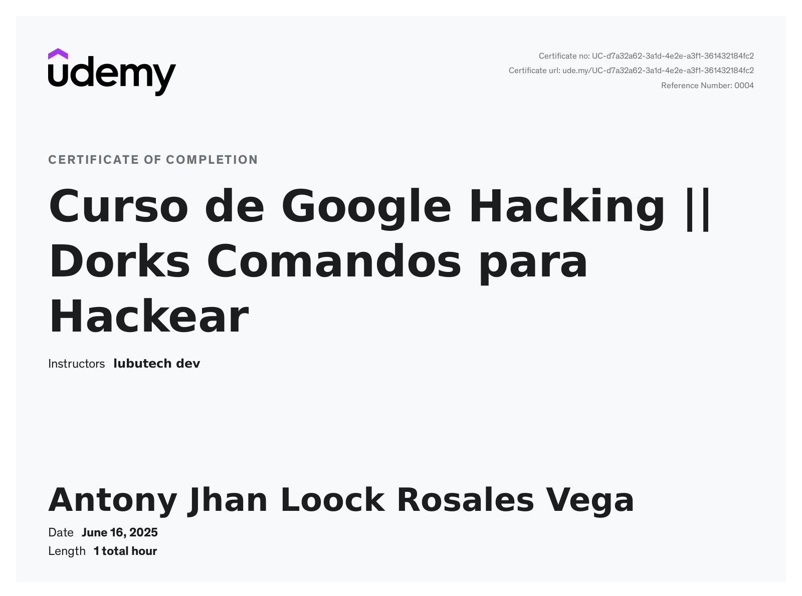
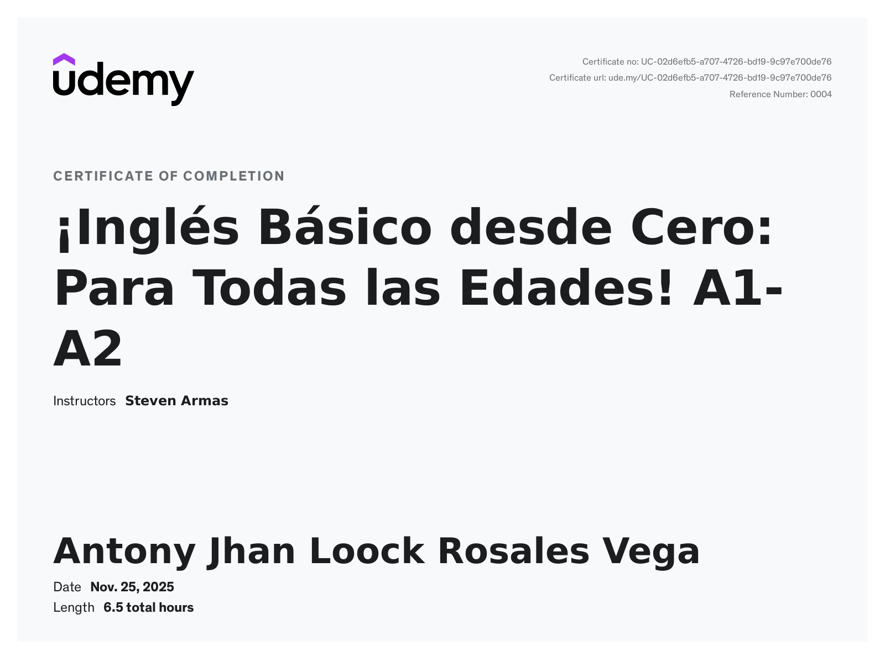
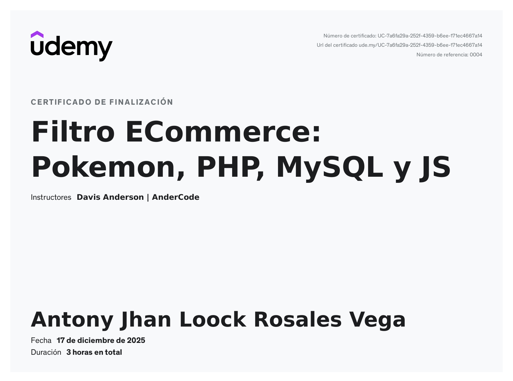

# ¡Hola! Soy Antony 👋

## 🚀 Sobre mí
Soy egresado del **Instituto Público Carlos Cueto Fernandini**. Mi perfil combina la precisión técnica de la **Metalurgia** 🏗️ con el mundo de la **Computación e Informática** 💻.

Actualmente, me encuentro potenciando mis habilidades en mi tercer módulo de prácticas pre-profesionales.

---

## 🛠️ Tecnologías y Herramientas

---

## 📜 Certificaciones

  
✅ Click aquí para ver mis certificados

  
  
  

### 📊 Mis Estadísticas
